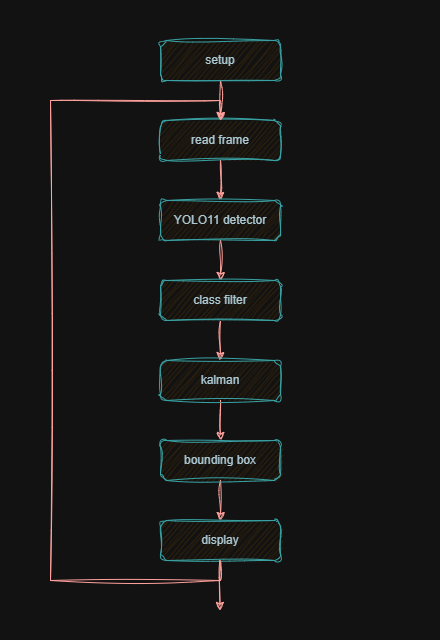
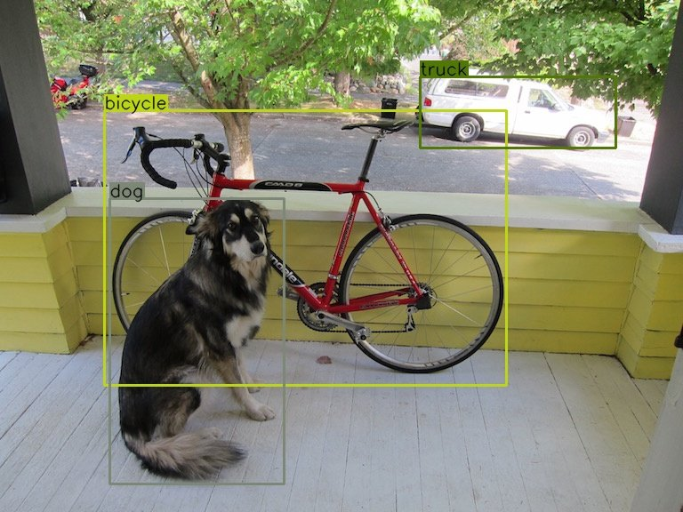

- [](https://colab.research.google.com/github/c4dynamics/c4dynamics/blob/main/docs/source/programs/car_tracker_yolo11/car_tracker_yolo11.ipynb) ← Click to open in Google Colab
- To download this notebook, click the download icon in the toolbar above and select the .ipynb format.
- For any questions or comments, please open an issue on the [c4dynamics issues page](https://github.com/c4dynamics/c4dynamics/issues).


# Car Tracker – YOLO11 Detector and Kalman Filter

*A modern-detector refresh of the [Car Tracker – YOLOv3 example](https://c4dynamics.github.io/c4dynamics/programs/car_tracker/car_tracker.html).*

This notebook tracks a car through a video by pairing a **YOLO11** object detector with a
**Kalman filter**. 
It is a direct re-implementation of the original
[Car Tracker](https://c4dynamics.github.io/c4dynamics/programs/car_tracker/car_tracker.html)
use case: 
the estimation problem, 
the dynamic model, 
and the filtering strategy are
unchanged, 
only the detector is swapped from **YOLOv3** 
(served through OpenCV's DNN module
inside `c4dynamics`) 
to **YOLO11** 
(served through the `ultralytics` package).


## Table of Contents

1. Setup
2. Theoretical Background 
3. Dynamic Model
4. Sensor Inputs
5. Filtering 
6. C4DYNAMICS
7. Main Loop 
8. Results
9. Summary 

A raw stream of detections is rarely good enough on its own: 
bounding boxes jitter from
frame to frame, 
and an object occasionally vanishes for a frame or two because of
occlusion or a missed detection. 
A Kalman filter fixes both problems by

- smoothing the bounding-box position and size, and
- predicting the object location on frames where the detector returns nothing.

The filter runs in a single **steady-state** mode: 
the model is linear and time-invariant,
so one Kalman gain is computed up front and reused for every frame. 

The original YOLOv3 example also carried an *adaptive-covariance* 
mode that tightened $R$ during the turns;
As YOLO11's detections are accurate enough, 
this notebook quantifies how much the filter smooths the detector output.




*Figure 1: Program flowchart.*

The tracking pipeline is a single loop over the frames of a video. 
Every frame is pushed
through the detector; 
the detection that matches the class we care about (`car`) is handed
to the Kalman filter as a measurement; 
and the filter's smoothed state is what we draw on
screen. 
When the detector misses, the loop still runs — the filter's `predict` step alone
carries the estimate forward.

## 1. Setup

On Google Colab the next cell installs the three required
dependencies:

- [c4dynamics](https://c4dynamics.github.io/c4dynamics/) – the Kalman filter and the
  `pixelpoint` state class,
- [ultralytics](https://docs.ultralytics.com/) – the YOLO11 model and weights,
- `opencv-python` – frame I/O and drawing.

Running locally, install the same packages once with
`pip install c4dynamics ultralytics opencv-python`.

```python


import sys
IN_COLAB = "google.colab" in sys.modules
if IN_COLAB:
    !pip install -q c4dynamics ultralytics opencv-python
    from google.colab.patches import cv2_imshow


```


```python


import cv2
import numpy as np
from IPython.display import Video
from IPython.display import display
from matplotlib import pyplot as plt

from c4dynamics.filters import kalman
from c4dynamics import plotdefaults, datasets


```


### Video dataset

The clip is the same one used by the original example — a car drifting on a race track,
from a [free stock library](https://www.pexels.com/video/a-car-drifting-on-a-racing-track-4568686/).
The `c4dynamics` [datasets module](https://c4dynamics.github.io/c4dynamics/api/Datasets.html)
downloads it and returns a path to the cached file:

```python


video = datasets.video('drifting_car')


```


```python


Video(video, width = 640, height = 360, embed = True)


```


Open the stream with OpenCV and read its frame rate. 
The sampling interval between
frames, 
$dt = 1 / fps$, 
is the time step the Kalman filter propagates the state over:

```python


video_cap = cv2.VideoCapture(video)
fps = video_cap.get(cv2.CAP_PROP_FPS)
dt  = 1 / fps

width  = int(video_cap.get(cv2.CAP_PROP_FRAME_WIDTH))
height = int(video_cap.get(cv2.CAP_PROP_FRAME_HEIGHT))
print(f'frame size = {width} x {height} pixels,  fps = {fps:.1f},  dt = {dt:.4f} s')


```


A writer stores the annotated frames so the result can be played back at the end:

```python


vidout = cv2.VideoWriter(
    'car_detected_yolo11.mp4',
    int(video_cap.get(cv2.CAP_PROP_FOURCC)), fps, (width, height)
)


```


## 2. Theoretical Background

### 2.1. YOLO11 Object Detection

**YOLO** 
(*You Only Look Once*) is a family of single-stage detectors: 
a single forward
pass of a convolutional network turns an image into a set of bounding boxes, 
each with a
class label and a confidence score. 
The network doesn't first propose potential regions and then analyze them separately; 
it does both in a single pass.
That's what makes the family fast enough for video.


**YOLO11** (2024) 
is the current generation from Ultralytics, 
released in several sizes from nano to extra-large. 
This notebook uses the smallest one, 
**YOLO11n** (`yolo11n`). 
Compared with **YOLOv3**
(2018), 
which the original notebook used, 
it keeps the same input/output contract 
— image in, boxes out — 
but differs in ways that matter for tracking:

| | YOLOv3 | YOLO11n |
|---|---|---|
| detection head* | anchor-based | anchor-free |
| backbone / neck | Darknet-$53$ | improved $CSP$ with $C3k2$ / $C2PSA$ blocks |
| parameters | $\approx 62$ M | $\approx 2.6$ M |
| served in this notebook via | OpenCV $DNN$ <br> c4dynamics.detectors.yolov3 | ultralytics package |

\* In anchor-based, 
the detector starts the bounding box prediction from a fixed set of anchor boxes to make the learning easier. 
In anchor-free detectors no priors so there are fewer hyperparameters. 

For our purpose the important consequence is that even this smallest YOLO11 model is both
smaller and more
accurate than YOLOv3, 
so the raw detections fed to the filter are already tighter and
jitter less. 
The tracking mechanism around it is identical.

Both models are trained on the **COCO** dataset and predict the same $80$ classes
(`person`, `bicycle`, `car`, `bus`, `truck`, …). We only use one of them, `car`.



*Figure 2: One-stage detection. A single pass of the network localizes and classifies every object in the frame at once — here the COCO classes dog, bicycle, and truck. In this notebook we run the same step with YOLO11 and keep only the car box.*

### 2.2. Kalman Filtering

New to Kalman filtering?
[c4dynamics’s filters page](https://c4dynamics.github.io/c4dynamics/concepts/filters.html
) provides a practical introduction to Kalman filtering, 
covering the underlying equations and their implementation through the predict/update algorithm.


A Kalman filter is the optimal linear estimator for a system driven by Gaussian noise.

It maintains a state estimate and its covariance, 
and updates them recursively in two
steps per frame:

- **Predict** – 
    propagates the state with the equations of motion, 
    $$\mathbf{x}_{k+1} = F \cdot \mathbf{x}_k$$
    where $\mathbf{x}_k$ is the state vector at frame $k$, $\mathbf{x}_{k+1}$ is the predicted
    state vector at frame $k+1$, and $F$ is the state transition matrix;
    and grows the covariance by the process noise $Q$. 
    This step runs in every sample.
- **Update** – 
    when a detection $z_k$ is available, 
    blends it with the prediction using the Kalman gain $K$, 
    which weighs the process noise $Q$ against the measurement noise $R$:
    
    $$ \mathbf{x}_k \leftarrow \mathbf{x}_k + K \cdot (z_k - H \cdot \mathbf{x}_k) $$

    where $z_k$ is the detection (measurement) at frame $k$, $H$ is the measurement matrix,
    and $K$ is the Kalman gain.

The gain $K$ sets the balance: 
when $R$ is small the estimate follows the detector; 
when
$R$ is large it follows the motion model. 
The $Q / R$ ratio is the one knob that trades
**jitter** (high ratio) against **lag** (low), and the closing section measures both.

To set the filter up we need three ingredients: 
initial conditions, a dynamic model ($F$, $Q$), and a measurement model ($H$, $R$). 
The initial conditions are best guess or first measurement of the state vector ($\mathbf{x}_0$) and the error covariance ($P_0$). The dynamic model and the measurement model are outlined in the following sections. 


## 3. Dynamic Model

Assume the car moves at approximately **constant velocity** between frames and that its
bounding box keeps a roughly **fixed size**. In discrete time the motion is a set of
first-order difference equations:

$$
\begin{aligned}
  {x_c}_{k+1} &= {x_c}_k + {v_x}_k \cdot dt \\
  {y_c}_{k+1} &= {y_c}_k + {v_y}_k \cdot dt \\
  w_{k+1} &= w_k    \\
  h_{k+1} &= h_k    \\
  {v_x}_{k+1} &= {v_x}_k  \\
  {v_y}_{k+1} &= {v_y}_k
\end{aligned}
$$

Where:

- $x_c, y_c$ are the coordinates of the bounding-box center pixel,
- $w, h$ are the bounding-box width and height in pixels,
- $v_x, v_y$ are the object velocities in $pixel / second$,
- $dt = 1 / fps$ is the time between frames,
- $k$ is the discrete frame index.

In state-space form:

$$ \mathbf{x}_{k+1} = F \cdot \mathbf{x}_k + \eta_k $$

where:

- $\mathbf{x}_k$ is the state vector at frame $k$, ($\mathbf{x} = [x_c, y_c, w, h, v_x, v_y]^T$, order $n = 6$),
- $\mathbf{x}_{k+1}$ is the predicted state vector at frame $k+1$,
- $F$ is the state transition matrix,
- $\eta_k$ is zero-mean white process noise with covariance $Q$; it absorbs everything the
  constant-velocity assumption leaves out (mainly the accelerations during the drift).

$$
F = \begin{bmatrix}
        1 & 0 & 0 & 0 & dt & 0 \\
        0 & 1 & 0 & 0 & 0 & dt \\
        0 & 0 & 1 & 0 & 0 & 0 \\
        0 & 0 & 0 & 1 & 0 & 0 \\
        0 & 0 & 0 & 0 & 1 & 0 \\
        0 & 0 & 0 & 0 & 0 & 1
      \end{bmatrix}
$$

where $dt = 1 / fps$ is the time step between frames.

```python


# process dynamics: constant velocity, constant box size
F = np.eye(6)
F[0, 4] = F[1, 5] = dt
print(F)


```


## 4. Sensor Inputs

### Detections Wrapper

The only sensor is the **YOLO11 detector**. 
Each call returns, for every detected
object, 
a bounding box $[x_c, y_c, w, h]$ and a class label. 
We wrap each detection in a
`pixelpoint` — the `c4dynamics` state class for "a point in an image with a bounding box" —
so it plugs straight into the filter's `update`.

```python


from c4dynamics import pixelpoint
print(pixelpoint())          # state layout: [ x  y  w  h ]


```


Load YOLO11-nano. 
The weights (`yolo11n.pt`, a few $MB$) download automatically on first
use and are then cached by `ultralytics`:

```python


from ultralytics import YOLO
model = YOLO('yolo11n.pt')


```


A thin adapter turns one frame into a list of `pixelpoint` detections. 
It mirrors the
`detect` method of `c4dynamics.detectors.yolov3` used in the original notebook, 
so the main
loop below is identical to that example:

```python


def detect(frame):
    """Run YOLO11 on a BGR frame, return a list of pixelpoint detections."""
    result = model(frame, verbose = False)[0]
    fsize  = (frame.shape[1], frame.shape[0])

    points = []
    for box in result.boxes:
        xc, yc, w, h = box.xywh[0].tolist()
        pp = pixelpoint(x = xc, y = yc, w = w, h = h)
        pp.fsize    = fsize
        pp.class_id = model.names[int(box.cls)]
        points.append(pp)
    return points


```


`pixelpoint.X` is the vector $[x_c, y_c, w, h]^T$ — exactly the measurement the filter
expects. 
The `class_id` attribute is used to reject everything that is not a `car`.

Two helpers convert the state vector into the pixel corners OpenCV needs to draw a
rectangle:

```python


# top-left and bottom-right corners of the bounding box
def tl(X): return int(X[0] - X[2] / 2), int(X[1] - X[3] / 2)
def br(X): return int(X[0] + X[2] / 2), int(X[1] + X[3] / 2)


```


### Measurement Model

The detector observes the first four state variables directly and says nothing about
velocity, 
so the measurement equation is

$$ z_k = H \cdot \mathbf{x}_k + \nu_k $$

where:

- $z_k$ is the measurement (detection) vector at frame $k$,
- $H$ is the measurement matrix,
- $\mathbf{x}_k$ is the state vector at frame $k$,
- $\nu_k$ is zero-mean measurement noise with covariance $R$.

$$
  H = \begin{bmatrix}
        1 & 0 & 0 & 0 & 0 & 0 \\
        0 & 1 & 0 & 0 & 0 & 0 \\
        0 & 0 & 1 & 0 & 0 & 0 \\
        0 & 0 & 0 & 1 & 0 & 0
      \end{bmatrix}
$$

where the $1$'s pick out $x_c, y_c, w, h$ — the first four entries of $\mathbf{x}_k$ — leaving
$v_x, v_y$ unobserved directly.

```python


H = np.zeros((4, 6))
H[range(4), range(4)] = 1
print(H)


```


The detector's true error is hard to pin down exactly. 
Following the original example
we set the one-sigma measurement noise ($R$) to a small fraction of the image width, 
and set
the process noise $Q$ with the same magnitude so that neither the model nor the detector
is favoured a priori:

$$ std_{measure} = \frac{im_{width}}{10000} $$

where $im_{width}$ is the frame width in pixels.

```python


measure_std = width / 10000
R = np.eye(4) * measure_std**2    # measurement covariance
Q = np.eye(6) * measure_std**2    # process covariance


```


## 5. Filtering

### 5.1. Observability

Before trusting the filter, check that the measurements actually constrain the whole
state. The system is observable if the observability matrix

$$
  \mathcal{O} = \begin{bmatrix}
        H \\ H \cdot F \\ H \cdot F^2 \\ \vdots \\ H \cdot F^{\,n-1}
      \end{bmatrix}
$$

where:

- $\mathcal{O}$ is the observability matrix,
- $H$ is the measurement matrix,
- $F$ is the state transition matrix,
- $n$ is the system order (state dimension),

has rank equal to the system order $n = 6$.

```python


O = H
n = len(F)
for i in range(1, n):
    O = np.vstack((O, H @ np.linalg.matrix_power(F, i)))
rank = np.linalg.matrix_rank(O)
print(f'rank(O) = {rank},  n = {n}  ->  '
      + ('observable' if rank == n else 'NOT observable'))


```


The velocities are observable even though they are never measured directly: two
successive position measurements pin them down through $F$.

### 5.2. Steady-State Kalman Gain

$F$, $H$, $Q$, $R$ are all constant, so the system is **linear time-invariant**. The
covariance $P$ and the gain $K$ then converge to fixed values and can be computed once, up
front, instead of every frame. The `kalman` class does this when `steadystate = True`:

```python


kf = kalman({'x': 0, 'y': 0, 'w': 0, 'h': 0, 'vx': 0, 'vy': 0},
            F = F, H = H, Q = Q, R = R, steadystate = True)
print(kf._Kinf)


```


Each measured variable is corrected by roughly $0.6$ of the innovation — the filter
splits the difference between prediction and detection, because we made $Q$ and $R$ equal.

## 6. C4DYNAMICS

Everything derived above — the state vector, $F$, $H$, $Q$, $R$, and the steady-state gain —
collapses into two `c4dynamics` objects:

- [kalman](https://c4dynamics.github.io/c4dynamics/api/filters.kalman.html) owns the model
  ($F$, $H$, $Q$, $R$) and runs the `predict` / `update` recursion from Section 5, so none of
  the linear algebra above needs to be re-implemented by hand.
- [pixelpoint](https://c4dynamics.github.io/c4dynamics/api/states.lib.pixelpoint.html) is
  the state container each detection is wrapped in — center pixel, bounding box, class label
  — ready to hand straight into the filter's `update`.

The main loop below is just these two objects talking to each other, once per frame.

## 7. Main Loop

The loop is the pipeline from *Figure 1*. 
`predict` runs on every frame; 
`update` runs only
when a `car` is detected. 
If the detector misses the car on a few frames, 
the
`predict` step alone carries the estimate. 

A green rectangle is drawn for an estimate when a detection is valid.
A red one when the estimate is based on a prediction alone. 

Alongside `kf.store(t)` we keep the raw detection
`zdet` and the posterior estimate `xhat` for every frame, 
to measure the smoothing later.

```python


t = 0
video_cap = cv2.VideoCapture(video)

xhat, zdet = [], []          # posterior estimate and raw detection, per frame

while video_cap.isOpened():
    kf.store(t)
    kf.predict()

    ret, frame = video_cap.read()
    if not ret:
        break

    # take only the first 'car' detection, if any
    d = next(iter([di for di in detect(frame) if di.class_id == 'car']), None)

    if d:
        kf.update(d.X)
        kf.detect = d
        kf.storeparams('detect', t)
        zdet.append(np.array(d.X, dtype = float))
        est_color = [0, 255, 0]    # green: detection is valid
    else:
        zdet.append(np.full(4, np.nan))     # detector missed the car on this frame
        est_color = [0, 0, 255]    # red: pure prediction

    xhat.append(np.array(kf.X[:4], dtype = float))

    cv2.rectangle(frame, tl(kf.X), br(kf.X), est_color, 2)

    if IN_COLAB:
        cv2_imshow(frame)
    else:
        cv2.imshow('', frame)
        cv2.waitKey(10)

    vidout.write(frame)
    t += dt

video_cap.release()
vidout.release()
if not IN_COLAB:
    cv2.destroyAllWindows()

xhat = np.array(xhat)
zdet = np.array(zdet)
have = ~np.isnan(zdet[:, 0])         # frames with a valid detection
print(f'{have.sum()} detections over {len(xhat)} frames '
      f'({(~have).sum()} misses bridged by predict-only)')


```


## 8. Results 

```python


Video('car_detected_yolo11.mp4', width = 640, height = 360, embed = True)


```


The video overlays a green box for an estimate based on a detection and a red box for a sheer prediction.  
YOLO11 never loses the car when it's entirely in the frame. 
Not even in direction changes where YOLOv3 needed support by shrinking R to compensate for the nonlinear behavior (against the actual linear model). 

### 8.1. Estimated Trajectory

`plot_track` draws the estimated trajectory on the image plane, optionally with the raw
detections and with timestamps:

```python


def plot_track(kf, title, detections = False, printtime = False, axislim = None):
    '''
    args:
        title: str
            title text
        detections: bool
            overlay the raw YOLO11 detections
        printtime: bool
            annotate key x positions with their timestamp
        axislim: list
            axis window [x_min, x_max, y_min, y_max]
    '''

    fig, ax = plt.subplots(1, 1, dpi = 200, figsize = (4, 2.25),
                         gridspec_kw = {'left': 0.15, 'right': .9, 'top': .9, 'bottom': .2})
    ax.plot(kf.data('x')[1], kf.data('y')[1], 'm', linewidth = 1., label = 'estimate')

    if detections:
        dxdy = np.vectorize(lambda d: (d.x, d.y) if isinstance(d, pixelpoint) else np.nan)(kf.data('detect')[1])
        ax.plot(dxdy[0], dxdy[1], 'co', markersize = .5, label = 'detection')

    plotdefaults(ax, title, 'X [px]', 'Y [px]', 8)
    ax.legend(fontsize = 6, facecolor = None)
    ax.invert_yaxis()

    if printtime:
        time   = kf.data('t')
        xgrid  = np.arange(0, width, 100)
        xdata  = kf.data('x')[1]
        txgrid = [time[np.argmin(np.abs(xdata - v))] for v in xgrid]
        yxgrid = [kf.timestate(txi)[1] for txi in txgrid]
        for pt in zip(txgrid, xgrid, yxgrid):
            ax.text(pt[1], pt[2], f'{pt[0]:.2f}', fontsize = 5, color = "black")

    if axislim:
        ax.axis(axislim)
    return fig


```


```python


fig = plot_track(kf, title = 'Car Tracker = YOLO11 + Kalman Filter', detections = True, printtime = True, axislim = [0, width, height, 0]);
display(fig); plt.close(fig);
print('Figure 3: tracker estimations and detections with time stamps.')


```


The path is clearly **not** a straight line, but it breaks into roughly three nearly
linear segments — which is why a constant-velocity model works as well as it does here.

Even at the sharpest corner the estimate stays within a few pixels of the detections — the
direction changes here are spread over enough frames that the constant-velocity model keeps
up. That comparison is meaningful precisely because the detector is never absent there: as
noted above, its only misses sit at the very start and end of the clip, while the car is
entering or leaving the frame, not at the corners.

The YOLOv3 version of this example had to shrink $R$ around these same instants — the
direction changes — to close a visible gap between the estimate and the detections. The
more accurate YOLO11 detections remove that gap outright, so a plain steady-state filter
is enough, with a real detection available at every one of those frames.

### 8.2. Quantifying The Smoothing

#### Jitter

YOLO11's detections are accurate, 
so the filter is not here to fix large errors — 
it is
here to take the **jitter** out of the detection stream. 

A convenient measure of that
jitter is the 
**frame-to-frame acceleration** 
of the track: 
the second difference of the
bounding-box center position,

$$
  a_k = \lVert\, p_{k+1} - 2 \cdot p_k + p_{k-1} \,\rVert
$$

where:

- $a_k$ is the frame-to-frame acceleration magnitude at frame $k$,
- $p_k$ is the bounding-box center position $[x_c, y_c]$ at frame $k$.

The time step is omitted because the objective is to compare jitter between the raw detections and the Kalman estimate at the same sampling interval, not to report physical acceleration. 

An object moving at constant velocity has 
$a_k = 0$, 
so the $RMS$ of $a_k$ over the run
isolates how much the track shakes *beyond* smooth motion. 
We compare it for the raw
detections and for the Kalman estimate, 
over the frames where a detection exists.

```python


def rms_accel(P, cols):
    """RMS frame-to-frame acceleration of columns `cols` of a state history."""
    a = np.diff(P[:, cols], n = 2, axis = 0)
    return np.sqrt(np.mean(np.sum(a**2, axis = 1)))

pos_raw, pos_filt = rms_accel(zdet[have], [0, 1]), rms_accel(xhat[have], [0, 1])
box_raw, box_filt = rms_accel(zdet[have], [2, 3]), rms_accel(xhat[have], [2, 3])

print('                 raw   filtered   reduction')
print(f'center [x, y]    {pos_raw:4.2f}    {pos_filt:4.2f}       {100 * (1 - pos_filt / pos_raw):3.0f} %')
print(f'box    [w, h]    {box_raw:4.2f}    {box_filt:4.2f}       {100 * (1 - box_filt / box_raw):3.0f} %')


```


```python


fig, ax = plt.subplots(figsize = (4, 2.4), dpi = 160)
x = np.arange(2)
ax.bar(x - 0.2, [pos_raw, box_raw],  0.4, label = 'raw detections')
ax.bar(x + 0.2, [pos_filt, box_filt], 0.4, label = 'kalman estimate')
ax.set_xticks(x)
ax.set_xticklabels(['center [x, y]', 'box [w, h]'])
plotdefaults(ax, 'Jitter: raw vs filtered', '', 'frame-to-frame accel  [px]', 8)
ax.legend(fontsize = 6)
display(fig); plt.close(fig);
print("Figure 4: Frame-to-frame acceleration (jitter) of the bounding box, \n"
    "before and after filtering. "
    "The Kalman estimate removes roughly 40% of \n"
    "the center jitter and 45% of the box-size jitter while "
    "staying on the \nsame trajectory."
)


```


#### Lag

The other side of the trade is **lag** — how far the estimate sits behind the detections:


$$
  e_k = \hat{p}_k - {p_d}_k
$$

where:

- $e_k$ is the position error between the bounding box center of the estimate and the detection at frame $k$,
- $\hat{p}_k$ is the Kalman bounding box center $[x_c, y_c]$ at frame $k$,
- ${p_d}_k$ is the raw detection bounding-box center $[x_c, y_c]$ at frame $k$.

The lag is the $RMS$ of the error magnitude: 

$$\text{lag} = \sqrt{\langle \lVert e_k \rVert^2 \rangle_k}$$


```python


lag = np.sqrt(np.nanmean(np.sum((xhat[:, :2] - zdet[:, :2])**2, axis = 1)))
print(f'mean estimate-to-detection distance: {lag:.1f} px '
      f'({100 * lag / width:.2f} % of the frame width)')


```


Under $4$ px — a fraction of a percent of the frame width. That is why this notebook needs
no adaptive-covariance mode: the YOLOv3 example shrank $R$ near the turns to close a visible
lag, but with YOLO11 the lag is already negligible.

#### Q/R Ratio Sensitivity Analysis 
How much smoothing you get is set by the $Q / R$ ratio. Re-running the filter
for a few values of $R$ (as a multiple of the baseline) traces the trade-off directly:

```python


def sweep(r_mult):
    R_ = np.eye(4) * measure_std**2 * r_mult
    k  = kalman({'x': 0, 'y': 0, 'w': 0, 'h': 0, 'vx': 0, 'vy': 0},
                F = F, H = H, Q = Q, R = R_, steadystate = True)
    xy = []
    for z, ok in zip(zdet, have):
        k.predict()
        if ok:
            k.update(z)
        xy.append(np.array(k.X[:2], dtype = float))
    xy = np.array(xy)
    accel = rms_accel(xy, [0, 1])
    lag   = np.sqrt(np.nanmean(np.sum((xy - zdet[:, :2])**2, axis = 1)))
    return accel, lag

r_mults = [0.25, 1, 4, 16, 64]
curve   = np.array([sweep(m) for m in r_mults])


```


```python


fig, ax = plt.subplots(figsize = (4, 2.6), dpi = 160)
ax.plot(curve[:, 1], curve[:, 0], 'o-', color = 'm')
for m, (a, l) in zip(r_mults, curve):
    ax.annotate(f'${m:g} \\times R$', (l, a), fontsize = 6,
                textcoords = 'offset points', xytext = (4, 4), color = 'black')
plotdefaults(ax, 'Jitter vs Lag',
             'lag (behind detections) [px]', 'jitter (frame-to-frame accel) [px]', 8)
display(fig); plt.close(fig);
print("Figure 5: The bias-variance trade-off. Increasing R (trusting the motion \n"
     "model more) lowers the jitter (less variance) but pushes the estimate further behind\n"
     "the detections (more bias). The baseline 1 x R already sits in the low-lag corner, \n"
     "so the filter configuration is a good default for this clip."
)


```


$$
R↑ \quad ⇒  \quad smoothing↑ \;\; jitter↓ \;\; lag↑
$$

## Summary

This notebook re-implements the [Car Tracker](https://c4dynamics.github.io/c4dynamics/programs/car_tracker/car_tracker.html)
use case with a **YOLO11** detector in place of **YOLOv3**.

- The detector is loaded from `ultralytics` (`yolo11n.pt`) and wrapped by a small `detect`
  adapter that returns `c4dynamics` `pixelpoint` objects — center pixel, bounding box, and
  class label — so the rest of the pipeline is byte-for-byte the original.
- The tracked state is $\mathbf{x} = [x_c, y_c, w, h, v_x, v_y]^T$, propagated with a
  constant-velocity, constant-box-size model ($F$, $Q$) and corrected by the detector
  ($H$, $R$).
- The system is $LTI$ and observable (rank $\mathcal{O} = 6$), so it runs in
  **steady-state** mode with a single precomputed gain $K$.
- On this clip the filter removes about $40\%$ of the detection jitter while lagging the
  detections by under $4$ px. The YOLOv3 version needed an extra adaptive-covariance mode to
  close a lag in the turns; the more accurate YOLO11 detections make that unnecessary.

Swapping in a newer detector changed one function; the estimation and filtering logic — the
`c4dynamics` part — did not move. That separation is the point.